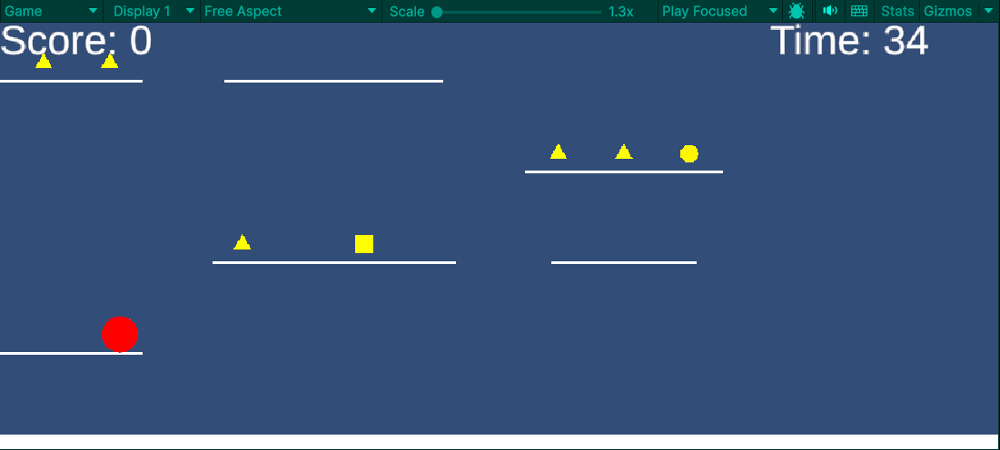

ゲーム制作技術総合実習 個人ワーク
（Circle, Triangle, Squareを使用した2Dゲーム）

# Shape Collect

## ゲームの内容
〇△□の形に変更可能なプレイヤーに右から4つの段差からなる地面ををジャンプしながらコインを集めるコインは同じ形でしか取れない
制限時間40秒で高いscoreを出すようにする

## 操作説明
- 1が〇,2が△,3が□に変形することが可能
- スペースキーを押すとジャンプができる
- 二段ジャンプが可能
- 出てくる地面は下から貫通できる上からは貫通できない
